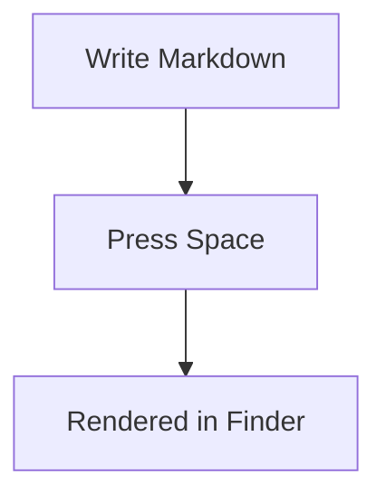

# QuickMD — Markdown & Code Quick Look Previewer

A macOS Quick Look extension and standalone app that renders Markdown files, syntax-highlights source code, and pretty-prints JSON/YAML — all from pressing `Space` in Finder.

## Features

- **Markdown rendering** with GitHub-style CSS (light & dark mode)
- **Mermaid diagrams** rendered inline via [mermaid.js](https://github.com/mermaid-js/mermaid)
- **Syntax highlighting** for 190+ languages via [highlight.js](https://highlightjs.org/) with GitHub theme
- **JSON pretty-printing** — minified JSON is auto-formatted with indentation
- **YAML formatting** — parsed and re-dumped with consistent indentation via [js-yaml](https://github.com/nodeca/js-yaml)
- **Source code viewer** — opens `.py`, `.swift`, `.rs`, `.go`, `.js`, `.ts`, `.c`, `.java`, and many more with syntax coloring

## Supported File Types

| Category | Extensions |
|----------|-----------|
| Markdown | `.md`, `.markdown`, `.mdown`, `.mkd` |
| JSON | `.json` |
| YAML | `.yaml`, `.yml` |
| Python | `.py` |
| Swift | `.swift` |
| Rust | `.rs` |
| Go | `.go` |
| C/C++ | `.c`, `.h`, `.cpp`, `.cxx`, `.cc`, `.hpp` |
| Objective-C | `.m`, `.mm` |
| JavaScript/TypeScript | `.js`, `.mjs`, `.jsx`, `.ts`, `.tsx` |
| Java | `.java` |
| Shell | `.sh`, `.bash`, `.zsh` |
| Web | `.html`, `.css`, `.xml` |
| Ruby | `.rb` |
| PHP | `.php` |
| SQL | `.sql` |
| And more | Kotlin, Scala, Haskell, Lua, Dart, Elixir, Erlang, Clojure, Zig, TOML, INI, Dockerfile, Makefile... |

## Stack

- Apple Quick Look Preview Extension (`QuickLookUI`)
- Markdown rendering via [`Down`](https://github.com/johnxnguyen/Down) (CommonMark)
- Syntax highlighting via [`highlight.js`](https://highlightjs.org/) with GitHub light/dark theme
- YAML parsing via [`js-yaml`](https://github.com/nodeca/js-yaml)
- Mermaid diagrams via [`mermaid.js`](https://github.com/mermaid-js/mermaid)

## Setup

1. Install Xcode and Xcode command line tools.
2. Install XcodeGen:
   ```bash
   brew install xcodegen
   ```
3. Generate and build:
   ```bash
   xcodegen generate
   xcodebuild -scheme QuickMDApp -configuration Debug \
     CODE_SIGN_STYLE=Manual CODE_SIGN_IDENTITY="-" DEVELOPMENT_TEAM="" build
   ```
4. Install to `/Applications`:
   ```bash
   cp -R DerivedData/.../QuickMD.app /Applications/QuickMD.app
   ```
5. Register the app and extension:
   ```bash
   lsregister -f -R -trusted /Applications/QuickMD.app
   pluginkit -e use -i com.pedro.QuickMDApp.QuickMDPreviewExtension
   qlmanage -r && qlmanage -r cache
   ```
6. In Finder, select any supported file and press `Space`.

## Usage

### Quick Look (Finder)

Select any supported file in Finder and press `Space` to see a rendered preview.

### Standalone App

Double-click a file or use `open -a QuickMD myfile.md` to open the full app with a resizable window.

### Mermaid Diagrams

Use fenced code blocks with the `mermaid` language tag:

````markdown

````

### JSON/YAML

Fenced code blocks tagged `json` or `yaml` are automatically pretty-printed and syntax-highlighted. Standalone `.json` and `.yaml` files are also rendered with formatting.
