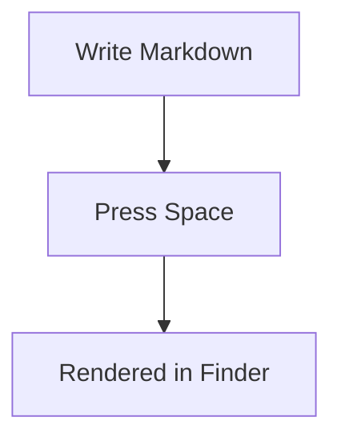

# QuickLook Markdown (Finder Space Preview)

This folder contains a macOS Quick Look plugin project so pressing `Space` on `.md` files in Finder shows rendered Markdown.

## Stack

- Apple Quick Look Preview Extension (`QuickLookUI`)
- Markdown rendering via [`Down`](https://github.com/johnxnguyen/Down)
- Mermaid diagrams via official [`mermaid`](https://github.com/mermaid-js/mermaid)

## Setup

1. Install Xcode and Xcode command line tools.
2. Install XcodeGen:
   ```bash
   brew install xcodegen
   ```
3. Generate the project:
   ```bash
   cd /Users/pedro/code/markdown/QuickLookMarkdown
   xcodegen generate
   ```
4. Open the generated project:
   ```bash
   open QuickLookMarkdown.xcodeproj
   ```
5. In Xcode, build and run `QuickLookMarkdownApp` once.
6. Enable extension in macOS:
   - `System Settings` -> `Privacy & Security` -> `Extensions` -> `Quick Look`
   - Turn on `QuickLookMarkdownPreview`
7. In Finder, select any `.md` file and press `Space`.

## Notes

- Supported UTTypes are configured in `QuickLookMarkdownPreviewExtension/Info.plist`.
- Mermaid support uses fenced code blocks:

````markdown

````
